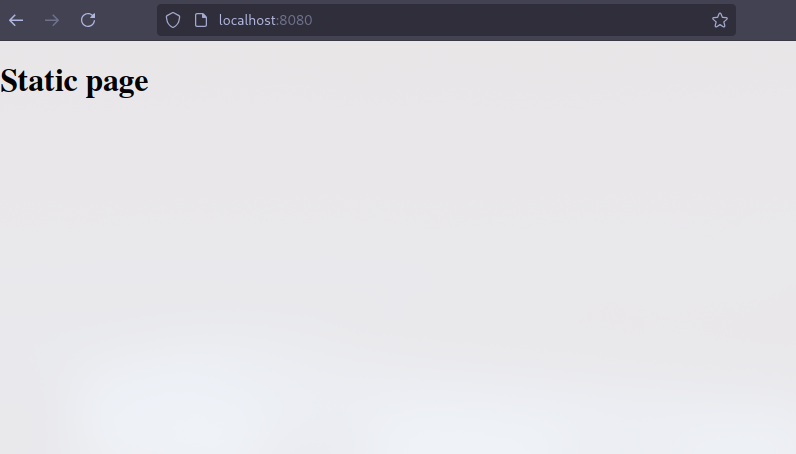
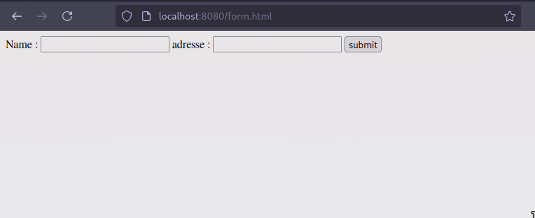
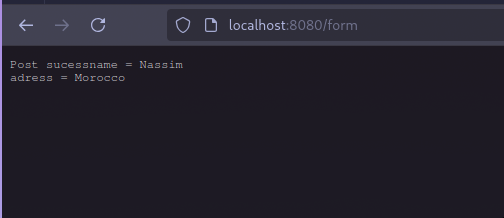

# Simple Go Web Server

This is a basic Go web server that serves static files, handles form submissions, and responds to a `/hello` route.

## Features

- Serves static files from the `static` directory.
- Handles GET requests at `/hello`, returning "hello world".
- Processes form submissions at `/form`.

## output





## Project Structure

```
/project-directory
│── main.go          # Main server code
│── static/
│   ├── index.html   # Homepage
│   ├── form.html    # Form page
│── README.md        # Project documentation
```

## Running the Server

1. Install Go (if not installed): [Go Installation Guide](https://go.dev/doc/install)
2. Navigate to the project directory:
   ```sh
   cd /path/to/project
   ```
3. Run the server:
   ```sh
   go run main.go
   ```
4. Open your browser and visit:
   - `http://localhost:8080/` for the static index page.
   - `http://localhost:8080/hello` for the Hello World endpoint.
   - `http://localhost:8080/form` to submit a form.

## Example Form Submission

If using `form.html`, submit a form with `name` and `address`. The server will process and display the values.
